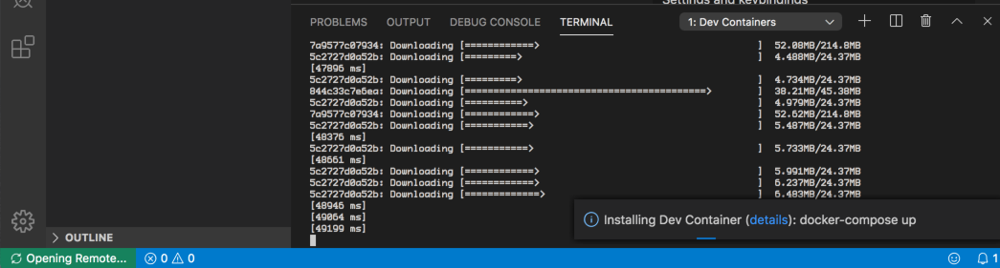

# Ansible with Postgres POC

Proof of Concept to use Postgres as a JSON configuration datastore for Ansible.


## Opening the project in Visual Studio Code

Open Visual Studio Code (VSC), click File -> Open, navigate to the folder containing the new project, in our case here, `poc`. Click **Open**.  The project will load in VSC.  Once loaded, click on the small green Icon on the bottom left hand corner of the editor. 


This will make the remote select dropdown appear.  


Chose **Remote-Containers: Reopen in Container**.

The project will now open in a docker container.



As this is the first time we are opening this container, it will take a while to open, as the required images need to be downloaded from teh docker image hub, to build the container. I suggest a coffee.

The container will be fully loaded and ready to use when the icon in the bottom left switches from **Opening Remote** to **Dev Container:poc (postgreSQL)**.

We can now test that the container is up and running by opening a terminal within VSC.  `CTRL+backtick` open the new terminal.

The command prompt of the new terminal will read:

``` bash
╭─vscode@poc-app /ansible
╰─$
```

## Testing the database is running

A small REST API test harness has been built following the [Test Driven Development](https://en.wikipedia.org/wiki/Test-driven_development) pattern, the database can be tested by running `sh test.sh` to tell Django to start a test process to ensure that the postgres database is up and running.  To begin, open the Integrated Terminal.  At the command prompt type the following:

```bash
╭─vscode@poc-app /ansible 
╰─$ cd /app 
╭─vscode@poc-app /app  
╰─➤  sh test.sh             
Creating test database for alias 'default'...
System check identified no issues (0 silenced).
...Waiting for database...
Database unavailable, waiting 1 second...
Database unavailable, waiting 1 second...
Database unavailable, waiting 1 second...
Database unavailable, waiting 1 second...
Database unavailable, waiting 1 second...
Database available!
.Waiting for database...
Database available!
................
----------------------------------------------------------------------
Ran 20 tests in 2.083s

OK
Destroying test database for alias 'default'...
╭─vscode@poc-app /app
╰─➤  
```

If the test can be seen to have passed as above, the DB is up and running.
